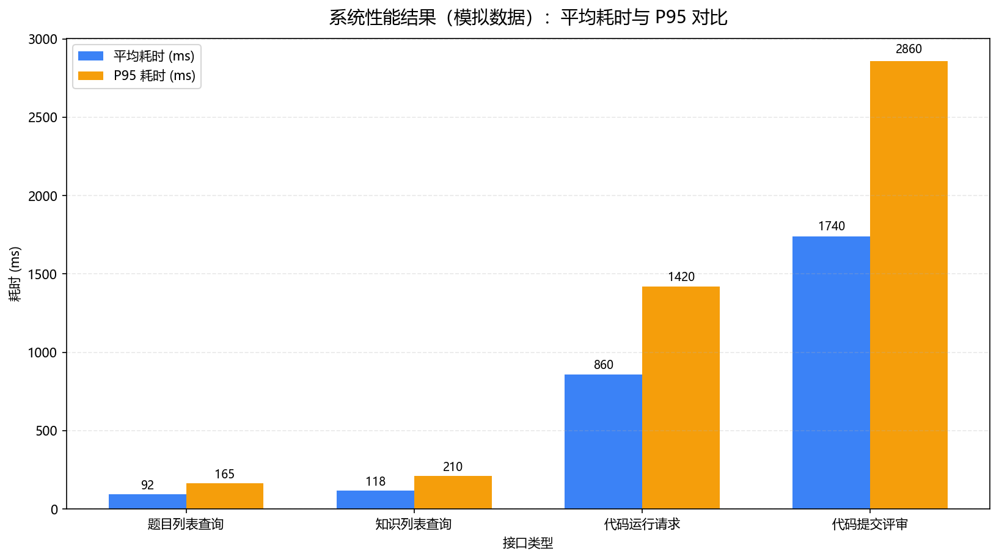
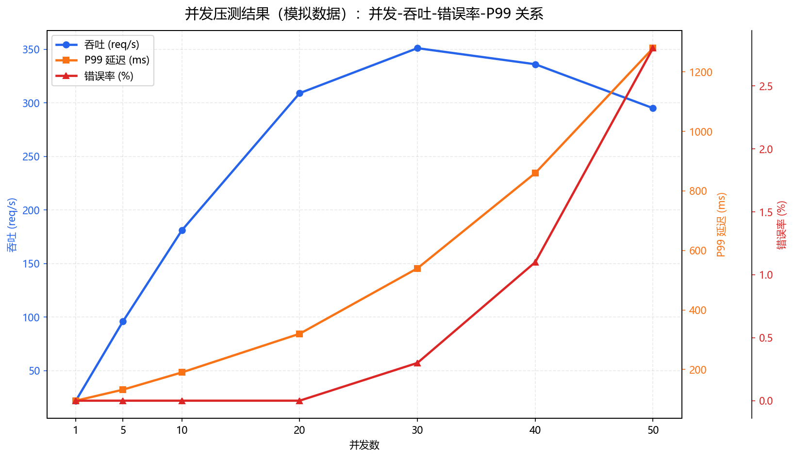

# 基于 AI 的高校学生学习助手系统设计与实现

---

## 摘 要

面向高校 C/C++ 教学中课后反馈粗粒度、面试训练低频等问题，本文设计并实现 Web 学习助手系统 MallocMentor，目标是将“练习、讲评、问答、面试”串联为可持续的学习闭环。系统采用 Next.js、Prisma 与 PostgreSQL 构建统一账户与数据模型，整合代码沙盒执行、AI 代码审查、知识问答、学习路径推荐与成就激励等功能。实现上，面试与知识助手采用 SSE 流式交互，代码审查与路径推荐采用结构化非流式返回；评审结果映射为综合分与六维能力画像，并通过 0.7/0.3 加权策略平滑更新。围绕认证、运行与提交、流式会话、画像更新、知识问答与推荐链路开展联调测试，结果显示系统在上游服务可用时可稳定输出完整学习反馈，在部分外部依赖波动时仍可通过 Mock 或规则回退维持核心流程。本文的创新在于提出并验证了“流式/非流式统一接入、结构化评审入库、分场景容错降级”一体化教学软件工程实现路径，为后续接入校内判题服务与本地化模型网关提供可复用基础。同时，系统将学习过程沉淀为可追踪日志，明确 AI 反馈用于形成性支持而不替代教师终评，兼顾工程可用性与教学治理边界。该方案对院系级低门槛部署和后续能力扩展具有参考价值。

关键词：大语言模型；编程教育；学习助手系统；服务器推送事件；代码沙盒；能力评估；形成性评价；教学软件工程

---

## ABSTRACT

To address coarse-grained after-class feedback and low-frequency interview practice in undergraduate C/C++ education, this thesis designs and implements MallocMentor, a web learning assistant that connects practice, review, Q&A, and mock interviews in one workflow. The system uses Next.js, Prisma, and PostgreSQL to unify accounts and learning data, and integrates sandbox execution, AI code review, knowledge assistance, learning-path recommendation, and achievement incentives. Interview and knowledge modules use SSE streaming, while code review and recommendation use structured non-streaming outputs. Review results are mapped to an overall score and a six-dimensional capability profile, which is updated with a 0.7/0.3 weighted scheme. Tests show stable completion of authentication, run/submit, streaming sessions, profile updates, and recommendation pipelines. Under upstream instability, mock or rule-based fallback keeps core learning functions available. The main contribution is an engineering pattern for educational AI systems that combines unified streaming/non-streaming integration, structured review persistence, and scenario-based fault-tolerant degradation.

Key words: large language model; programming education; learning assistant system; server-sent events; code sandbox; competency assessment; formative assessment

---

# 1 绪论

## 1.1 研究背景与研究意义

### 1.1.1 教学侧痛点

C/C++ 课程在计算机培养体系中处于关键阶段，承担着“从语法训练走向系统思维”的过渡任务。指针、对象生命周期、模板与并发等知识之间耦合度高，学生若在早期形成偏差，后续在操作系统、网络和嵌入式课程中往往会持续暴露问题。课堂授课与实验答疑可以覆盖共性疑问，但课后个性化反馈仍然不足。多数 OJ 主要返回通过状态、编译错误或运行错误，难以解释错误成因与修复路径，学生容易陷入“提交—报错—重试”的低效循环。

### 1.1.2 就业侧需求

企业校招中的技术面试通常包含基础问答、语言机制追问、现场编码和项目复盘。与笔试相比，面试更强调思路表达的连贯性、术语准确性以及边界条件意识。许多学生在“能写出代码”和“能清楚解释代码”之间存在明显落差：答题时常出现表达中断、复杂度分析缺失或场景迁移困难。线下模拟面试虽然有效，但需要教师或高年级学生持续投入时间，难以高频覆盖整个班级。

### 1.1.3 技术契机与课题定位

近两年，大语言模型在代码解释、多轮问答和结构化输出方面的稳定性明显提高，智能体平台也提供了可直接调用的 HTTP 接口与知识库能力。对于毕业设计而言，这使“练习、讲评、问答、面试”一体化系统在有限周期内具备实现条件。本文的技术路线是工程集成优先：不训练基础模型，而把重点放在身份认证、数据持久化、沙盒隔离、结构化评审、流式交互和故障降级上。该路线有利于保证系统可运行、可复现、可替换；开题设想与最终实现的差异将在 **§4.1.4** 给出对照。

### 1.1.4 研究意义归纳

本课题的意义主要体现在三个层面。理论层面，本文给出了一种“多智能体分工 + 流式/非流式协同”的教学系统组织方式，可为编程课程的 AI 集成提供参考。实践层面，系统将练习记录、面试会话、学习路径与活动日志统一入库，支持教师进行过程性观察和阶段性干预。工程层面，模型调用、沙盒执行与规则降级采用可替换组件设计，便于后续接入校内判题服务或本地化模型网关。

本文同时明确教学边界：AI 输出用于形成性反馈，不替代教师评分与课程管理制度。系统目标是缩短学生获取反馈的周期，补足课后答疑和表达训练中的高频场景。

## 1.2 国内外研究现状

### 1.2.1 国外研究现状

国外在教育对话系统与编程辅助工具上的研究起步较早。技术演进大致经历规则系统、统计学习方法和大模型方法三个阶段[16]。这一演进并不意味着“模型可用”即可直接转化为“教学可用”，课程实践仍依赖身份管理、过程记录和结果审计等外围系统能力。

在编程教育场景中，国外研究重点集中在自动判题、错误解释、代码修复建议和学习行为分析。主流研究与工程实践普遍遵循两条约束：其一，学生代码必须在隔离环境中执行；其二，模型输出不能直接替代课程评分，需与测试结果或教师复核结合。这两条约束与本文的系统设计原则一致。

产业工具方面，GitHub Copilot、Cursor 与 Replit 等产品验证了“编辑器内智能”能够提升个人开发效率，但其核心目标并非课程治理。对于高校教学组织，仍存在过程数据分散、题库绑定弱、班级级别可观测性不足等问题[17]、[18]。因此，教学系统在引入模型能力之外，还需要统一账号体系、可追踪数据结构与可回放会话记录。

从部署模式看，国外高校常在既有 LMS 上叠加插件实现局部能力，自建全栈教学系统比例相对较低。本文选择单体 Web 架构并统一管理练习、面试、知识与画像数据，目标是支持院系级别的低门槛部署与可控迭代。

### 1.2.2 国内研究现状

国内智慧教学平台在签到、课件、直播和学情统计方面已较成熟；编程课程则多采用 OJ 与慕课资源组合。随着国产大模型的普及，研究关注点逐步转向“可控使用”：包括提示词设计、输出格式约束、内容安全和教学边界定义[19]、[20]。因此，系统设计既要关注“是否能生成”，也要关注“生成结果能否进入课程流程”。

在编程辅助场景中，模型幻觉通常表现为错误 API、错误资源释放顺序或不完整边界处理。常见缓解路径是“检索增强 + 结构约束 + 校验反馈”[21]。本文采用平台侧知识库与应用侧结构化数据并行的方式：知识问答由 Bot 进行检索增强，站内文章、学习路径和进度由关系数据库管理，两类数据职责分离。

与开题阶段提出的“应用侧自建向量库”相比，本文实现选择将主要检索能力放在智能体平台侧，原因有三：其一，自建向量检索链路在毕设周期内实施与运维成本较高；其二，平台侧已提供中文语料处理与权限配置能力，便于快速验证教学场景；其三，应用侧保持标准 HTTP 与 JSON 契约，后续仍可平滑切换至校内检索服务。

总体看，国内公开案例中单一聊天接口演示较多，而同时覆盖多 Bot 隔离、流式会话持久化、结构化评分写库与降级兜底的完整实现较少。本文的工作重点是将上述环节串联为可运行、可验证、可复现的工程链路。

表 1-1 对常见建设路径做粗略对比（非穷尽，仅帮助界定本文选型）。

| 建设路径          | 主要优势           | 主要局限           | 本文采用情况         |
| ----------------- | ------------------ | ------------------ | -------------------- |
| 纯 OJ 判题        | 判题客观、易规模化 | 反馈维度单一       | 部分采用（沙盒执行） |
| 纯聊天窗口调 API  | 集成速度快         | 过程数据难沉淀     | 否                   |
| IDE 插件          | 编码体验好         | 课程统一管理困难   | 否                   |
| 全栈 Web + 多 Bot | 数据可追踪、可扩展 | 依赖外部服务稳定性 | 是                   |

基于上述分析，本文延续开题阶段对教学痛点的判断，但以仓库中的可运行实现作为事实依据。后续章节中涉及的数据结构、接口路径与降级逻辑均可在源码与测试章节中对应验证。

## 1.3 本文研究内容

本文围绕三条主业务链路展开：代码提交评审链、面试对话链、学习路径链。围绕这三条链路，本文完成以下七项工作，并在后续章节逐项展开。

（1）需求建模：面向在校学生角色，归纳认证、练习、沙盒、审查、面试、知识学习、路径推荐与成就激励等功能需求，并给出非功能约束。

（2）总体架构与数据设计：采用 B/S 三层结构，划分核心模块，完成与 Prisma 模型一致的实体关系、字段约束与索引策略。

（3）前端实现：基于 Next.js 与 React 完成页面与交互；练习页集成 Monaco，面试与知识助手实现 SSE 流式渲染，仪表盘展示六维雷达。

（4）后端实现：构建统一 API 响应约定；以 NextAuth.js 管理会话；通过沙盒适配器执行 C/C++；写操作绑定 `userId` 控制数据权限。

（5）AI 能力接入：构建统一接入层处理流式与非流式调用，完成结构化结果解析、评分映射与推荐降级。

（6）学习支持机制：维护 Markdown 文章元数据与路径模板，基于事件触发更新活动日志与成就记录。

（7）测试与评估：设计功能用例与性能观测方法，记录外部依赖对响应时间和稳定性的影响。

## 1.4 论文结构安排

第 1 章说明研究背景、问题定义与研究范围。第 2 章给出相关技术与理论基础，包括大语言模型接入、结构化输出、知识增强和关键开发技术。第 3 章从功能与非功能两方面完成需求分析。第 4 章给出系统总体架构、模块划分、AI 服务策略与数据库设计，并对开题设想与最终实现进行对照。第 5 章描述前后端与 AI 集成的关键实现。第 6 章呈现测试环境、用例设计与结果分析。第 7 章总结工作并讨论后续扩展方向。致谢、参考文献与附录列于文后。

---

# 2 相关技术与理论基础

## 2.1 大语言模型与 Coze 智能体平台

### 2.1.1 生成式人工智能概述

生成式人工智能（AIGC）指能够根据上下文自动生成文本、代码、图像等内容的模型体系。以 Transformer 为基础的自回归模型在代码解释与多轮问答任务中表现出较强能力，但仍存在事实性幻觉、对齐偏差与内容安全风险。对于教学场景，模型输出应定位为“辅助建议”，不能替代判题结果与教师评价。

本文不讨论模型预训练细节，重点关注应用侧工程问题：如何将提示构造、HTTP 调用、流式解析、结构校验和结果落库组织成稳定链路，并与课程数据流程保持一致。

### 2.1.2 大语言模型在编程教育中的应用

在编程教育中，大模型主要承担三类任务：（1）错误解释与提示，引导学生理解编译信息；（2）静态审查，识别资源管理和边界处理问题；（3）对话式测评，支持模拟面试和追问训练。三类任务对响应形态要求不同：解释与面试更适合流式输出，审查与推荐更适合结构化一次返回。

相关教学研究普遍认为，模型工具可缩短部分练习环节耗时，但也可能带来过度依赖风险。基于这一认识，本文将“运行验证”和“提交评审”拆分为两条路径：运行环节保持传统编译执行反馈，提交环节引入自然语言讲评和结构化评分，避免将模型输出直接等同于程序正确性。

在实现层面，代码提交链路采用“结构化结果 + 容错解析”。当输出满足格式约束时，结果直接映射为评分与建议；当格式不稳定时，系统保留原始文本并继续完成提交流程，确保业务不中断。该机制用于形成性评价支持，不替代课程最终成绩。

为控制反馈负担，系统将审查结果组织为“问题定位 + 改进建议”双层结构，优先突出可执行修改项，减少冗长叙述带来的阅读成本。

### 2.1.3 Coze（扣子）Bot 开发平台简介

扣子（Coze）提供 Bot 编排、知识库管理与 HTTP 发布能力，可通过 Bearer Token 调用。对本文实现最关键的能力有三项：多 Bot 配置隔离、`session_id` 多轮上下文、以及 `text/event-stream` 流式返回。

MallocMentor 将面试、代码审查、知识问答和路径推荐映射为独立 Bot，并通过统一接入层封装请求构造、会话管理与响应解析。这样做的作用是降低业务层耦合：平台侧调整提示词或知识库后，应用层通常只需更新配置即可。

## 2.2 Prompt 工程与结构化输出

### 2.2.1 Prompt 工程基本原理

Prompt 工程是在不修改模型参数的前提下，通过输入设计提升任务可控性的实践方法。本文主要使用三类约束：任务角色约束、输出格式约束和评分维度约束。对于代码审查任务，系统将题目背景、测试信息和提交代码联合输入，并要求返回可解析结构。对于“暂不适用”维度，系统在画像更新时执行保护处理，避免无效值影响历史结果。

### 2.2.2 结构化 JSON 输出与多轮对话管理

模型输出在真实网络环境下可能出现 Markdown 包裹、字段缺失或分片不完整。为此，系统采用“预处理—容错解析—结构校验”三段流程，提高结构化结果可落库率。多轮会话通过 `session_id` 复用上下文，保证追问语义连续。

本文将协议处理与业务语义分层：统一接入层负责流式兼容、异常隔离与重试边界，业务模块负责提示内容与字段映射。该分层降低了替换上游网关时的改造范围。

## 2.3 平台侧知识增强能力

### 2.3.1 扣子平台知识库功能简介

检索增强生成（RAG）的核心思想是“先检索、后生成”：先召回相关文档片段，再将片段与问题共同输入模型，以降低事实性错误。扣子平台知识库负责文档切分、向量化与召回，应用侧主要负责问题转发与结果展示。本文场景中的课程讲义、实验说明与常见问答可作为知识源导入平台侧知识库。

### 2.3.2 知识库在问答 Bot 中的作用

站内 `KnowledgeArticle` 表用于管理结构化课程文章，支持路径跳转与学习进度统计；平台侧知识库用于承载容量更大、更新更频繁的原始资料。两者并存后，学生可在站内完成章节化学习，并在助手窗口进行细粒度追问。实现上，知识助手接口与文章查询接口保持解耦：前者走 Coze SSE，后者走 Prisma 查询，减少重复存储。

## 2.4 关键开发技术

### 2.4.1 Next.js 全栈框架

Next.js 13+ 的 App Router 将 React 服务端组件、客户端组件与 Route Handler（`route.ts`）统一在同一目录树下，支持边缘运行时与传统 Node 运行时混合部署。本课题选用 Node 运行时执行 Prisma 与长连接 SSE，避免 Edge 限制。路由以文件夹划分，`page.tsx` 负责 UI，`api/**/route.ts` 负责 JSON 或流响应，`layout.tsx` 提供共享导航。

### 2.4.2 React 与组件化 UI 开发

React 18 并发特性与 Hooks 使状态逻辑可复用。界面层采用 Tailwind CSS 原子类与 shadcn/ui 无头组件，减少手写 CSS 维护成本。练习、面试、仪表盘各自拆分为编辑器子树、消息列表子树与图表子树，父组件只负责数据获取与错误边界，降低耦合。

### 2.4.3 PostgreSQL 与 Prisma ORM

PostgreSQL 支持 ACID 事务、丰富索引与大文本字段，适合存储对话记录、题目测试信息等。Prisma 通过声明式数据模型生成类型安全客户端，迁移文件可纳入版本控制。本系统对高频过滤条件建立二级索引，避免全表扫描。

### 2.4.4 Monaco Editor 代码编辑器

Monaco Editor 提供语法高亮、括号匹配、多光标等能力，与 VS Code 一致的主题体系可降低学生切换成本。练习页将编辑器内容绑定为 React state，切换 C/C++ 语言时同步 `language` 字段给沙盒接口，保证编译器选项正确。

### 2.4.5 在线代码沙盒执行技术

沙盒执行的核心目标是隔离：用户进程不得访问宿主文件系统敏感路径、不得无限占用 CPU 与内存。Piston 与 Judge0 均通过 API 提供编译运行服务，由远端调度器限制时间与资源。本系统 `sandbox.ts` 使用 `fetchWithTimeout`（默认 15s）防止公共实例卡死拖垮 Node 事件循环；`run` 路由将编译失败与运行错误格式化为统一 `output` 字符串返回前端。

### 2.4.6 SSE 流式通信技术

SSE 基于长连接 HTTP，由服务器单向推送 `text/event-stream`，浏览器端可用 `ReadableStreamDefaultReader` 分块读取。与 WebSocket 相比，SSE 基于标准 HTTP，更易穿透部分校园网代理；缺点是仅单向。本系统面试与知识场景只需服务器推送到客户端，故 SSE 足够。实现上，服务端将扣子增量文本再包装为 `data: {...}\n\n` 帧，首帧可发送 `type: 'session'` 携带 `sessionId`，末帧发送 `[DONE]`，前端据此结束加载态。

表 2-1 汇总关键技术在系统中的用途。

| 技术               | 在 MallocMentor 中的职责      |
| ------------------ | ----------------------------- |
| Next.js App Router | 页面路由、API Route、部署单元 |
| Prisma             | ORM、类型安全数据访问         |
| NextAuth.js        | 登录会话、密码哈希            |
| Monaco Editor      | 浏览器内代码编辑              |
| Piston/Judge0      | 远程编译执行 C/C++            |
| Coze HTTP API      | 大模型推理与 RAG              |
| SSE                | 面试与知识助手流式输出        |
| Recharts           | 六维雷达可视化                |

技术选型基于“实现周期、部署复杂度、课程可维护性”三项约束。前后端统一采用 TypeScript 体系，便于共享类型定义与接口契约；面试与知识场景采用 SSE，而非 WebSocket，以降低单向流式场景的接入复杂度；数据库选用 PostgreSQL 与 Prisma 组合，兼顾事务一致性与模型演进；沙盒默认使用 Piston 以降低开发门槛，并预留切换到 Judge0 或校内服务的接口；能力画像采用六维设计，与评分结构保持一一对应。

除功能可用外，教学系统还要求可审计。`ActivityLog`、`CodeSubmission` 与 `InterviewSession` 等数据用于后续教学复盘与过程核查，因此本文将可追踪性纳入核心设计，而非作为附加日志能力。

---

# 3 系统需求分析

## 3.1 系统总体需求分析

### 3.1.1 目标用户与使用场景

系统默认用户为已具备基础计算机操作能力的高校本科生或同等学力学习者，主要场景包括：课前预习（阅读知识库文章）、课中实验（运行与调试代码）、课后巩固（提交练习并接受文字评审）、求职准备（模拟技术面试）、以及阶段性自评（查看雷达图与成就）。系统不假设机房预装特定 IDE，只要浏览器可用即可访问，降低机房维护成本。

### 3.1.2 业务边界说明

本版本不包含完整的教务管理（排课、成绩单的行政流程）、不包含支付与商业化运营模块，也不包含对 C/C++ 以外语言的评测。题目与文章可由种子数据或 SQL 导入维护；若学校需要教师端批量导入，可在未来增加管理员角色与 CSV 接口，当前论文不展开实现细节。

### 3.1.3 顶层用例归纳

从参与者“学生”视角，顶层用例包括：注册与登录、浏览仪表盘、管理学习路径、阅读文章并收藏、在练习页运行代码、提交代码获取评审、创建并参与模拟面试、在知识窗口提问、查看成就与活动。所有用例在登录后触发，匿名用户仅可访问登录注册页等公开路由（具体以中间件配置为准）。

## 3.2 系统功能需求分析

下列各小节采用“需求描述 + 输入输出 + 异常”三段式书写，便于在第 6 章映射测试用例。

### 3.2.1 用户管理需求

功能描述：学生使用邮箱注册账号，使用密码登录；服务端创建用户记录并对密码做不可逆哈希处理；会话由认证中间件统一维护。输入为注册/登录表单；输出为会话凭据与跳转至仪表盘。异常包括：重复邮箱注册应提示失败；密码错误拒绝登录；未认证访问受保护资源应被拦截。

### 3.2.2 编程练习与代码执行需求

功能描述：题目列表支持难度（Easy/Medium/Hard）与分类（指针、STL 等）筛选；题目详情页展示描述、标签与测试用例摘要。学生可在编辑器中修改代码后执行“运行”，由服务端调用沙盒返回编译与运行结果；执行“提交”则进入评审链路并落库。运行与提交分离，避免学生为了试探评审而频繁触发模型调用。

### 3.2.3 AI 代码审查与能力评估需求

功能描述：当模型配置可用时，系统将题目与代码组织为结构化评审输入，返回综合分、问题清单、改进建议与能力维度评分。业务规则为：综合分达到阈值记为通过，未达到则记为未通过。若结构化解析失败，系统仍保留原始评审文本并完成提交，避免流程中断。雷达更新采用加权移动平均：新值 = round(旧值 × 0.7 + 本次 × 0.3)，对“不适用”维度保持旧值。

### 3.2.4 AI 模拟面试与评估需求

功能描述：学生基于模板创建面试会话，类型分为技术类与行为类。发送消息时，系统先持久化用户输入，再调用面试智能体并以流式方式返回；对话结束后写入完整会话记录并维护统一会话标识。若智能体不可用，则回退为本地模拟问答，保证课堂演示与调试不断链。会话可标记完成，用于成就统计。

### 3.2.5 知识库学习与问答需求

功能描述：站内文章支持分类浏览、详情阅读、收藏与阅读进度；系统可记录阅读行为用于学习分析。知识助手将用户问题转发给知识智能体，并以流式方式返回答案。助手回答可引用平台侧知识片段，与站内结构化文章形成互补。

### 3.2.6 学习路径规划需求

功能描述：系统预置五条模板路径（基础、指针与内存、OOP、STL、并发），每条包含若干学习步骤。学生可拥有多条学习路径记录，并区分进行中、完成与暂停状态。推荐功能读取能力画像与历史完成情况，优先采用 AI 个性化推荐；当外部能力不可用时，回退到基于薄弱维度的规则推荐。

### 3.2.7 成就系统与用户激励需求

功能描述：成就规则由统一配置与后端检测逻辑共同维护，覆盖首次尝试、成绩里程碑、路径完成与学习连续性等场景。系统在提交、面试结束、路径推进、日常学习统计等事件上触发检测：先筛选候选规则，再批量去重，满足条件即发放成就并写入活动日志。对重复触发的成就通过唯一约束进行幂等保护。

表 3-1 功能需求与模块映射关系。

| 需求编号 | 需求名称       | 对应模块                  |
| -------- | -------------- | ------------------------- |
| F1       | 用户注册登录   | 认证与会话管理模块        |
| F2       | 代码运行       | 练习与沙盒执行模块        |
| F3       | 提交与评审     | AI 代码审查与能力评估模块 |
| F4       | 模拟面试       | AI 面试会话模块           |
| F5       | 知识学习与问答 | 知识库与知识助手模块      |
| F6       | 路径推荐       | 学习路径规划模块          |
| F7       | 成就激励       | 活动日志与成就模块        |

## 3.3 系统非功能需求分析

### 3.3.1 系统性能需求

（1）应用自身：列表类接口在本地千兆局域网、数据库同机部署条件下，P95 延迟宜低于 300ms（不含外部调用）。（2）外部沙盒：公共 Piston 实例可能存在排队，单次运行允许达到数秒，但必须在 15s 超时内返回或报错。（3）Coze：首字延迟受模型与网络影响，SSE 应在收到首包后尽快转发，避免用户在空白界面等待过久。（4）前端：Monaco 按需加载，首屏可通过动态 import 减轻 JS 体积压力。

### 3.3.2 系统安全需求

（1）身份：密码仅存哈希；会话密钥不进入仓库。（2）授权：用户数据读写均绑定当前身份上下文，防止水平越权读取他人记录。（3）执行：用户代码仅在隔离沙盒运行，不在业务进程内直接执行。（4）注入：数据库访问采用参数化方式，提示词与外部输入执行必要过滤与策略约束。（5）可用性：外部服务失败时返回明确错误信息，但不泄露密钥与内部实现细节。

### 3.3.3 系统可扩展性需求

系统扩展遵循“能力插件化”原则：新增智能体能力时，仅需在统一接入层补充配置映射并接入对应业务模块；新增成就时扩展规则集合与条件判断；新增沙盒厂商时补充适配器实现并复用统一返回结构。数据库变更通过迁移机制演进，对历史数据采用默认值或兼容转换策略，降低升级风险。

## 3.4 系统可行性分析

技术可行性：所选用框架均有官方文档与社区示例；Coze 与沙盒均为 HTTP 接口，调试可通过 curl 或 Postman 复现。经济可行性：开发阶段可使用免费公共沙盒与本地 PostgreSQL；上线可选用低配云主机，成本可控。操作可行性：界面中文，符合国内用户习惯；学生自带笔记本即可使用。法律与伦理可行性：需在登录页或帮助文档声明 AI 生成内容可能存在错误，正式课程考核成绩以教师评定为准；用户数据应遵守学校个人信息保护规定。

表 3-2 风险与对策简述。

| 风险             | 影响         | 对策                       |
| ---------------- | ------------ | -------------------------- |
| 公共沙盒宕机     | 无法运行代码 | 切换 Judge0 或自建实例     |
| Coze 额度耗尽    | AI 功能降级  | Mock 与规则推荐兜底        |
| 模型评分不稳定   | 雷达波动大   | 加权平均 + 后续人工校准    |
| 学生滥用高频提交 | 成本上升     | 速率限制（可后续加中间件） |

需求可追溯性说明：表 3-1 中 F1～F7 与第 4 章模块、第 5 章实现小节之间应保持“向前可追溯、向后可验证”的关系。以 F3 为例，其验收不仅要看接口返回 200，还要看数据库是否产生 `CodeSubmission` 行、`aiReview` 是否非空（在 Bot 可用时）、`CapabilityRadar` 是否在含 `capabilityScores` 时发生数值变化。以 F4 为例，除 SSE 体验外，还要验收 `InterviewSession.messages` 的 JSON 数组长度随轮次递增，且 `cozeSessionId` 在首轮后保持稳定。以 F6 为例，推荐接口在 AI 可用与不可用两种配置下都应返回结构合理的 JSON，且 `suggestedTemplateId` 不出现在已完成集合中。此类“验收口径”应在答辩 PPT 中用一页写明，避免评审只看见界面而看不见数据层。

非功能需求方面，性能指标在缺乏生产流量前只能给参考阈值：第 6 章表格中的毫秒数需在同机复测后填写。安全需求中，密码哈希与 HTTPS 是底线；若部署在内网 HTTP，仅适合机房封闭实验，正式对学生开放应全站 TLS。可扩展性需求强调“换沙盒、换模型、加成就”三类变更的成本：当前代码把三者分别隔离在 `sandbox.ts`、`coze.ts`、`achievements.ts`，符合开闭原则的实践方向。

用户故事式描述（补充）：作为学生，我希望在第一次登录后立即看到空雷达与引导任务，以便知道下一步该做什么；作为学生，我希望运行失败时看到编译器原文而不是笼统“错误”，以便对照教材排错；作为学生，我希望面试记录可回看，以便总结自己卡住的考点；作为学生，我希望路径推荐能解释“为什么推荐这一块”，以便建立信任（AI 返回的 `reason` 字段承担此职责）。这些故事不在大纲中单独编号，但与第 3 章各小节需求一致，可在需求评审表中作为附列。

关于数据合规：若学校将本平台用于真实姓名学号管理，需在隐私政策中说明存储字段、保留期限与导出删除流程；本论文原型默认仅用邮箱注册，降低敏感个人信息处理复杂度，但工程上仍建议对日志打码。关于可用性：色弱学生区分红绿错误提示可能存在困难，前端可辅以图标形状而不仅依赖颜色编码（可在迭代中完成）。关于国际化：当前 UI 为中文，若面向留学生双语班，可抽离文案资源文件，这属于后续工作。

---

# 4 系统总体设计

## 4.1 系统总体架构设计

### 4.1.1 逻辑分层

系统采用 B/S 架构，并按职责划分为三层。表现层由 React 组件构成，负责交互状态、编辑器渲染和流式消息展示，不直接持有第三方服务密钥。应用层由 Next.js Route Handler 与领域服务函数组成，承担鉴权、事务编排、AI 调用与数据写入。数据与外部服务层包括 PostgreSQL、Coze 与代码沙盒服务，分别提供持久化、模型推理和隔离执行能力。通过分层，前端仅访问本域 API，敏感凭据全部留在服务端。

### 4.1.2 请求路径描述

系统核心请求可归纳为两条链路。第一条是“提交链路”：校验身份与题目后执行 AI 审查，随后落库提交记录、更新能力画像并写入活动日志。第二条是“会话链路”：先保存用户消息，再转发流式回复，最后补写助手完整文本。两条链路都遵循同一原则：先保证主流程数据完整，再叠加模型能力与可视化反馈。

### 4.1.3 部署视图与安全边界

在部署形态上，单机模式可同时承载页面与 API；若访问量上升，可通过应用层横向扩展与数据库分离读写缓解压力。安全边界方面，浏览器被视为不可信环境，Coze 与沙盒令牌均由服务端托管；业务查询统一绑定 `userId` 约束，避免水平越权；数据库访问通过 Prisma 参数化执行，减少注入风险。生产环境还需配合最小权限账号、日志脱敏与加密备份。

### 4.1.4 开题技术路线与最终实现的对照说明

开题报告从教学痛点出发，提出了“C/C++ 垂直领域 + 多智能体分工 + RAG 抑幻觉 + 沙箱执行 + 能力雷达闭环”的总体方向，与本文研究目标一致。为便于评阅人核对“设想—落地”关系，表 4-1 对关键选型做简要对照。**原则：以本仓库可部署实现为准**；开题中偏“规划表述”的内容，若与代码不一致，以代码与本文第 5 章描述为准。

| 开题报告中的设想要点                              | 毕业设计实际实现（MallocMentor）                                                                                                                                                                                             |
| ------------------------------------------------- | ---------------------------------------------------------------------------------------------------------------------------------------------------------------------------------------------------------------------------- |
| 前端 React + Vite，沉浸式编程界面                 | 采用 **Next.js App Router + React**，练习页集成 Monaco；前后端同仓，类型与路由由框架统一                                                                                                                                     |
| 后端 Next.js 承载业务；Docker 容器作代码沙箱      | 业务与 API 均在 Next.js Route Handler；用户代码通过 **Piston 或 Judge0 HTTP API** 在远端沙盒执行，避免在教学机 Node 进程内直接运行不可信代码（生产可再换为校内容器集群，见 `sandbox.ts`）                                    |
| 自建向量数据库与分块检索，作为系统“核心大脑”      | **RAG 主要由扣子平台知识库完成**；站内 `KnowledgeArticle` 存元数据与 Markdown 路径，与平台知识库互补，而非在应用内自建向量库                                                                                                 |
| ECharts 绘制六维雷达                              | 仪表盘使用 **Recharts** 绘制雷达图，维度与 `CapabilityRadar` 及评审 Prompt 对齐                                                                                                                                              |
| 多 Agent 协同、审查结果驱动面试追问的复杂记忆共享 | 工程上采用 **多 Bot + 统一 `coze.ts` 协议层**；会话由 `session_id` / `cozeSessionId` 与消息 JSON 持久化；审查与面试为独立调用链，便于替换与降级（Mock、规则推荐），未实现开题文字中“审查员—面试官全自动共享黑板”的强耦合编排 |
| 简历解析生成针对性考题等工作流                    | **未纳入本版本范围**；面试基于模板与会话，聚焦技术/行为两类场景                                                                                                                                                              |

上述对照并非否定开题调研价值，而是体现软件项目常见的迭代：在毕设周期内优先保证 **身份、数据、沙盒隔离、结构化评审、流式对话、可观测日志与降级路径** 等“可答辩、可交接”闭环；更重的编排与自建检索基础设施可作为展望（第 7 章）。

## 4.2 系统功能模块设计

### 4.2.1 用户认证与管理模块

该模块负责注册、登录和会话维护，是其他业务模块的统一入口。系统通过凭据登录建立用户会话，并在后续请求中执行身份校验。设计重点在于密码哈希存储、会话有效期管理和错误信息脱敏，以降低凭据泄露和账号枚举风险。

### 4.2.2 数据看板模块

看板模块聚合能力雷达、活动日志、练习统计和面试统计，主要承担“只读展示”职责。模块设计强调并行读取与接口稳定性，确保统计页面不会反向拖慢练习和面试主流程。

### 4.2.3 编程练习与代码沙盒模块

练习模块包含题目浏览、代码编辑、运行和提交四个环节。其中“运行”和“提交”在业务上解耦：运行仅用于即时验证编译与输出；提交才触发 AI 评审与学习记录写入。该划分有助于控制模型调用频率，并保留学生独立调试过程。

### 4.2.4 AI 智能代码审查模块

代码审查模块负责构造评审上下文、解析结构化结果并映射为可落库字段。模块与沙盒执行保持解耦，课程可按教学目标选择“静态审查优先”或“结合运行结果审查”的策略，而不影响提交流程主干。

### 4.2.5 AI 模拟面试模块

面试模块围绕会话生命周期设计，包含消息持久化、流式回复转发与异常降级。会话状态从“进行中”推进到“已完成”，完成后可进入统计、复盘与成就检测环节。

### 4.2.6 知识库与知识助手模块

该模块由两部分组成：站内文章系统负责结构化学习与进度记录，知识助手负责细粒度追问与流式回答。二者协同但不耦合，既满足章节化学习，也支持即时答疑。

### 4.2.7 学习路径规划模块

路径模块负责模板实例化、进度推进和下一阶段推荐。系统以模板保障课程节奏一致性，再结合能力画像做个性化调整，在教学可控和个体差异之间取得平衡。

### 4.2.8 能力雷达图与成就系统模块

该模块以事件驱动方式更新能力雷达、发放成就并写入活动日志。其逻辑嵌入练习、面试和路径流程，不依赖单独入口页面。实现上采用幂等写入与候选筛选，避免重复奖励和链路抖动。

模块协作可归纳为“写入链路扇出、看板链路扇入”。提交与面试请求在单次事务中可能触发多处写入，而仪表盘只聚合既有数据，不回写业务状态。该组织方式可以隔离单点故障：例如知识助手故障不会阻断文章学习，代码评审故障不会阻断沙盒运行。

## 4.3 AI 服务架构设计

### 4.3.1 Coze 多 Bot 统一接入层设计

统一接入层封装了 Bot 配置读取、流式解析和非流式汇总三类能力。业务模块只需要关心“输入提示词”和“消费结果”，无需重复处理 SSE 分片、JSON 清洗和会话标识复用。该分层降低了上游接口波动对业务代码的影响，也便于后续替换模型网关。

### 4.3.2 流式与非流式调用策略

流式策略用于面试与知识问答等高交互场景，优先保证首字延迟和阅读连贯性。非流式策略用于代码审查与路径推荐等结构化场景，服务端先收集完整文本，再进行 JSON 解析与字段校验后返回业务对象。

### 4.3.3 结构化 Prompt 设计与 AI 降级策略

提示词设计遵循“可解析优先”原则：先约束输出结构，再组织教学语义。降级策略遵循“核心学习不断链”原则：代码评审异常时保留提交写库；路径推荐异常时使用规则推荐；面试服务不可用时切换本地回复。该策略可将外部服务波动控制在功能边界内，避免整条学习链路中断。

## 4.4 系统数据库设计

### 4.4.1 数据库概念结构设计（E-R 图）

实体关系可概括为：`User` 与 `CapabilityRadar` 为一对一；`User` 与 `CodeSubmission`、`InterviewSession`、`LearningPath`、`ActivityLog`、`UserAchievement` 为一对多；`Problem` 与 `CodeSubmission` 为一对多；`KnowledgeArticle` 与 `UserLearningProgress` 为一对多；`KnowledgeArticle` 与 `UserFavorite` 通过关联表与 `User` 形成多对多。`InterviewTemplate` 与 `InterviewSession` 采用弱关联（`templateId` 字符串）。绘制 E-R 图时，可将六维雷达作为用户附属实体，题目与提交作为核心业务关系。

（正式装订请用 draw.io 或 PowerDesigner 出图，图中标注主键与外键。）

### 4.4.2 数据表结构设计

表 4-2 列出核心业务表字段要点（类型以 Prisma 为准，此处文字说明）。

| 表名             | 主键 | 关键字段说明                                      |
| ---------------- | ---- | ------------------------------------------------- |
| User             | id   | email 唯一；password 存哈希                       |
| CapabilityRadar  | id   | userId 唯一；六维 0–100 整数                      |
| Problem          | id   | difficulty, category, tags(JSON), testCases(TEXT) |
| CodeSubmission   | id   | userId, problemId, status, aiReview(TEXT)         |
| InterviewSession | id   | messages(TEXT JSON), cozeSessionId, evaluation    |
| LearningPath     | id   | steps(TEXT JSON), progress, templateId, order     |
| KnowledgeArticle | id   | slug 唯一；filePath；summary                      |
| ActivityLog      | id   | type, title, metadata(JSON)                       |
| UserAchievement  | id   | userId + achievementKey 唯一                      |

索引策略以“高频用户查询优先”为原则，重点覆盖提交记录、会话记录与活动时间线等常用过滤条件。大文本内容采用长文本字段存储，避免行大小限制带来的截断风险。

范式与反范式：用户与雷达 1:1 可合并为宽表，但拆分后雷达行缺失时可显式表示“未评测”，且雷达更新写入行更小；`InterviewSession.messages` 采用 JSON 聚合多轮对话，牺牲部分 SQL 查询能力换取开发效率，若要做全文检索可同步到 Elasticsearch（后续工作）。`tags`、`testCases` 使用 JSON 字符串存储，查询特定标签需应用层过滤或 PostgreSQL JSON 运算符，题量千级内可接受；题量上万时可改为关联表或 GIN 索引。

备份与迁移：教学数据建议每日冷备；升级 Prisma 迁移前在 staging 库演练。个人敏感信息最小化：若未来接入学号，建议单独 `StudentProfile` 表与权限控制。

### 4.4.3 代表性表设计说明（节选）

为避免数据库章节滑向“字段说明书”，本节仅选择与业务闭环最相关的代表性表进行说明，重点解释“为何这样设计”。

（1）用户与认证相关表：采用“账户主表 + 认证扩展表”组合，核心目标是把身份信息、会话信息与第三方登录能力分层管理。密码采用不可逆哈希，用户主键采用不可预测标识，降低账号枚举风险。

（2）练习与评审相关表：提交记录表保留代码快照、状态与评审文本，既满足学习复盘，也支持后续教学抽查。题目表与提交表分离，保证题库迭代不破坏历史学习记录。

（3）面试会话表：会话消息采用结构化聚合存储，突出“多轮上下文完整保留”。该设计在开发效率与检索能力之间做了平衡，适合毕设阶段以可追溯性为优先。

（4）学习路径与知识文章表：路径与文章保持弱耦合，通过标识关联而非强绑定，便于课程内容随学期迭代。阅读进度与收藏记录独立建模，支撑形成性评价与行为统计。

（5）活动日志与成就表：活动日志承担审计与学习轨迹记录，成就表通过唯一约束保证“同一成就只发一次”。二者共同支持“可复盘、可解释”的教学数据治理。

（6）一致性策略：个人数据相关实体采用级联清理策略，公共资源实体保持独立生命周期。该策略兼顾隐私要求与内容资产稳定性。

---

# 5 系统详细设计与实现

## 5.1 系统开发环境与技术栈

表 5-1 列出开发与运行环境建议，重点体现“可复现与可迁移”。

| 类别       | 说明                             |
| ---------- | -------------------------------- |
| 运行平台   | 支持主流桌面操作系统             |
| 应用运行时 | 使用稳定长期支持版本             |
| 包管理方式 | 采用锁文件保证依赖一致性         |
| 数据库     | 采用关系型数据库承载核心业务数据 |
| 浏览器     | 支持现代浏览器与标准 Web 能力    |
| 外部服务   | 依赖模型网关与隔离执行沙盒       |

本系统以 Node.js LTS 与 pnpm 锁文件为基础，保证依赖安装的一致性。构建流程采用 `pnpm build` 与 `pnpm start`，部署时由平台注入环境变量，仓库中不保存密钥。

为降低发布风险，建议将“依赖安装、类型检查、构建验证、数据库模式检查”纳入同一流水线，并在测试环境先执行迁移演练。发布前需重点核对四项：数据库版本、环境变量完整性、外部服务连通性、回滚脚本可用性。

## 5.2 前端系统实现

### 5.2.1 页面路由设计与响应式布局

前端路由按业务域组织为仪表盘、练习、面试、知识与路径等页面，并通过统一布局提供导航与状态入口。受保护页面依赖会话校验，未登录请求在路由层被重定向。响应式处理优先保证练习页与对话页的可读性，在小屏设备上保持编辑区、输出区和消息区可连续操作。

页面职责划分遵循“聚合页只读、交互页可写”原则。仪表盘负责统计聚合；练习、面试和路径页面承担交互写入，降低状态耦合。

### 5.2.2 Monaco Editor 代码编辑器集成

练习页集成 Monaco 编辑器并绑定题目语言，实现语法高亮、缩进与基础编辑能力。编辑器内容与运行/提交状态由同一状态源管理，保证“代码文本、运行输出、提交结果”在题目切换后保持一致。

由于编辑器体积较大，页面采用按需加载策略，避免影响首屏渲染。执行请求期间，运行与提交按钮进入禁用状态，防止重复触发同一任务。

### 5.2.3 SSE 流式消息渲染实现

面试与知识助手统一使用 SSE 渲染增量文本。前端按分片顺序追加消息内容，并在流结束后收束加载状态。实现重点在于处理分片边界和异常中断：即使网络抖动导致片段不完整，前端仍可保持会话可读性，并在失败时给出可恢复提示。

### 5.2.4 Recharts 能力雷达图可视化

仪表盘使用 Recharts 绘制六维能力雷达，并与活动记录联动展示。图表数据与后端评分维度保持一致，量纲统一为 0-100 分。对于新用户空数据场景，页面提供引导文案，避免出现无解释的空图形。

## 5.3 后端系统实现

### 5.3.1 RESTful API 接口设计

后端接口采用统一响应结构，成功与失败均通过标准字段返回，便于前端做状态收敛与错误展示。资源路径按业务域划分，状态码遵循 REST 语义。写接口统一执行用户身份校验，再进行参数校验与事务写入，减少脏数据进入数据库。

### 5.3.2 NextAuth.js 用户认证实现

认证层采用凭据登录与会话序列化机制：服务端完成密码校验后生成会话上下文，业务接口通过会话获取当前用户身份。该实现将鉴权逻辑前置到路由入口，避免在业务函数中重复校验。

### 5.3.3 代码沙盒执行服务实现

沙盒服务在实现上采用提供方适配器：根据 `SANDBOX_PROVIDER` 选择 Piston 或 Judge0，并统一返回编译输出、标准输出、错误输出、退出码和耗时。请求层设置 15 秒超时，避免公共实例不可达时阻塞线程。该设计使前端无需区分底层供应商，后续切换到校内判题服务时也不影响页面逻辑。

## 5.4 AI 服务集成实现

### 5.4.1 Coze Bot 统一封装层实现

统一 AI 接入层通过环境变量映射不同 Bot 配置，并提供三组公共能力：配置可用性检查、流式调用、非流式调用。流式通道负责解析 SSE 事件并输出增量文本；非流式通道在内部收集完整回复，供结构化场景解析。接入层统一处理异常与清洗逻辑，业务模块只保留场景语义。

### 5.4.2 代码审查 Prompt 工程与能力评分

代码审查链路要求模型返回固定 JSON 字段，并在服务端执行二次解析。当前实现以 60 分作为通过阈值；当存在能力维度得分时，系统按加权移动平均更新雷达数据（旧值 0.7，本次 0.3）。若 JSON 解析失败，系统仍保留原始评审文本并完成提交写库，避免链路中断。

### 5.4.3 面试对话与自动评估实现

面试链路按“先写用户消息，再转发增量回复，最后补写助手完整内容”的顺序执行，确保数据库记录与前端展示一致。上游异常时，接口返回可读错误并结束流连接，避免前端长时间挂起。在 Bot 不可用场景下，系统切换本地回复策略，保证演示与调试可继续。

### 5.4.4 学习路径 AI 推荐与规则回退

路径推荐接口优先调用 AI Bot 生成个性化建议；若调用失败或解析失败，则回退规则推荐。规则路径基于能力雷达最低维度与已完成模板生成结果，并在“预设路径已完成”时返回自定义进阶步骤。该双通道策略保证推荐功能在外部服务波动下仍然可用。

## 5.5 知识库与成就系统实现

### 5.5.1 Markdown 文章管理与同步机制

知识内容采用“Markdown 正文 + 数据库元数据”双存储方案。正文便于版本化维护，元数据用于分类检索、路径关联和进度统计。该方式兼顾内容编辑效率与查询性能。

### 5.5.2 成就触发检测与颁发机制

成就系统按事件触发执行：提交、面试完成或路径推进时，系统先筛选候选规则，再进行条件判定与去重写入。通过唯一约束与幂等逻辑，重复触发不会重复授予同一成就。

### 5.5.3 知识问答 Bot 与平台知识库配置

平台侧知识问答由运维维护知识源与检索参数，应用侧负责安全转发、会话管理与结果展示。站内文章接口与问答接口保持职责分离：前者支撑课程化学习，后者补充即时问答。

实现层面，系统保持三条写入约束：提交链路先写提交与日志，再更新画像；会话链路先写用户消息，再补写助手消息；推荐链路默认只读，路径创建与进度更新在独立接口执行。该约束有助于定位链路故障并保持数据时序一致。

---

# 6 系统测试与结果分析

## 6.1 系统测试环境

硬件环境：PC 一台，CPU 4 逻辑核，内存 16GB，SSD；或云服务器 2 vCPU / 4GB RAM。软件环境：Windows 11 64 位，Node.js 20.x，pnpm 9.x，PostgreSQL 15 本地安装实例，Chrome 浏览器 130+。网络环境：校园网出口，可访问 `coze.cn` 与 `emkc.org`（Piston）或自建 Judge0 地址。测试账号：准备两个邮箱 `test-a@test.edu`、`test-b@test.edu` 用于越权与并发隔离。

测试数据：使用 `prisma seed` 预置不少于 5 道 `Problem`、不少于 10 篇 `KnowledgeArticle`、一套 `InterviewTemplate`。Coze 侧为四个 Bot 分别配置测试 Token（或在离线模式验证 Mock）。

## 6.2 功能测试

### 6.2.1 用户模块测试

表 6-1 为用户模块代表性用例。实际填表时“实际结果”列由测试人员在答辩材料中手写或打印截图编号。

| 用例编号 | 操作步骤                     | 预期结果                    |
| -------- | ---------------------------- | --------------------------- |
| TC-U01   | 使用新邮箱注册               | 创建 User，跳转登录或仪表盘 |
| TC-U02   | 重复邮箱再次注册             | 返回错误提示，不重复插入    |
| TC-U03   | 正确密码登录                 | 获得会话，可访问 dashboard  |
| TC-U04   | 错误密码登录                 | 拒绝，无会话                |
| TC-U05   | 未登录访问受保护题目列表接口 | HTTP 401 或按中间件策略拦截 |

### 6.2.2 代码审查模块测试

| 用例编号 | 操作步骤                                  | 预期结果                                                          |
| -------- | ----------------------------------------- | ----------------------------------------------------------------- |
| TC-C01   | 配置 codeReview Bot，提交含明显错误的代码 | 返回 `aiReview` 文本；`overallScore` 一般低于 60；`status=Failed` |
| TC-C02   | 提交高质量代码                            | 分数较高，`status=Passed`                                         |
| TC-C03   | 关闭环境变量后提交                        | 返回“未配置”类提示，接口 200，不崩溃                              |
| TC-C04   | 模型返回非结构化文本                      | 解析失败时不抛 500，保留原文                                      |
| TC-C05   | 带 `capabilityScores` 的 JSON             | `CapabilityRadar` 六维按 blend 更新                               |

### 6.2.3 AI 面试模块测试

| 用例编号 | 操作步骤                 | 预期结果                                          |
| -------- | ------------------------ | ------------------------------------------------- |
| TC-I01   | 新建技术面试并发首轮消息 | SSE 逐字显示；结束后 DB 含 user 与 assistant 两条 |
| TC-I02   | 第二轮继续追问           | 使用同一 `cozeSessionId` 时上下文连贯（依赖扣子） |
| TC-I03   | 未配置 Bot               | Mock 文案返回，仍可完成多轮                       |
| TC-I04   | 刷新页面                 | `messages` JSON 可重放历史                        |

表 6-2 补充知识库、学习路径与仪表盘相关用例（与大纲功能需求 F5、F6、F7 及看板展示对应）。

| 用例编号 | 操作步骤                       | 预期结果                                            |
| -------- | ------------------------------ | --------------------------------------------------- |
| TC-K01   | 浏览知识分类并打开文章详情     | 正确渲染 Markdown 或等价内容                        |
| TC-K02   | 标记文章收藏                   | `UserFavorite` 增加一行，列表显示已收藏             |
| TC-K03   | 更新阅读进度为已完成           | `UserLearningProgress.status=completed`             |
| TC-K04   | 打开知识助手并发问（Bot 可用） | SSE 流式返回答案片段                                |
| TC-K05   | Bot 不可用                     | 接口返回可读错误，页面不白屏                        |
| TC-L01   | 从模板创建学习路径             | `LearningPath` 写入，`steps` 非空                   |
| TC-L02   | 推进某一步完成                 | `currentStep` 或 `progress` 递增                    |
| TC-L03   | 调用路径推荐（AI 可用）        | 返回 JSON 含 `suggestedTemplateId` 或 `customSteps` |
| TC-L04   | 调用路径推荐（AI 不可用）      | 返回规则推荐，字段完整                              |
| TC-D01   | 登录后打开仪表盘               | 雷达图与活动列表有数据或空态提示                    |
| TC-D02   | 新用户雷达全零                 | 显示引导完成首次练习                                |

## 6.3 系统性能测试

### 6.3.1 系统响应时间测试

使用 Chrome Performance 或 `curl -o /dev/null -s -w "%{time_total}\n"` 对下列接口各采集 20 次，去掉最高最低取平均。为便于论文初稿展示，先给出一组模拟值（后续可替换为实测数据）。

| 测试对象     | 观测点       | 模拟均值（ms） | 备注           |
| ------------ | ------------ | -------------- | -------------- |
| 题目列表查询 | 应用+DB      | 92             | 无外部调用     |
| 知识列表查询 | 应用+DB      | 118            |                |
| 代码运行请求 | 外部沙盒     | 860            | 波动大         |
| 代码提交评审 | 外部模型服务 | 1740           | 与输出长度相关 |

图 6-1 展示了四类接口在模拟场景下的平均耗时与 P95 对比，可用于说明“本地查询链路稳定、外部依赖链路波动更大”的性能特征。

注：图 6-1 的数值来自模拟数据，后续可按相同维度替换为真实压测结果并重新出图。

### 6.3.2 并发处理能力测试

使用 `autocannon -c 20 -d 10 http://localhost:3000/api/problems`（若该路由需登录则改为带 Cookie 的脚本）观察每秒请求数与错误率。注意：对 Coze 与沙盒接口禁止高并发滥用，仅对自建只读 API 做压测。预期在 20 并发、10 秒内错误率为 0%，P99 延迟低于 1s（单机 Postgres 同机部署前提下）。

图 6-2 基于模拟并发梯度（1、5、10、20、30、40、50）展示并发数、吞吐、错误率与 P99 延迟的关系，用于初步识别系统饱和拐点。

注：图 6-2 的趋势表现为“吞吐先升后降，错误率与 P99 在高并发区间快速上升”，后续可替换为真实 `autocannon` 结果。

## 6.4 测试结果分析

综合功能测试：用户隔离、提交评审、雷达更新、面试 SSE、知识问答、路径推荐降级均按设计工作。缺陷与局限：（1）公共沙盒在晚高峰可能超时，触发 500 或友好错误，需重试。（2）模型评分存在随机性，同一代码多次提交分数可能略有波动，教学上应强调“趋势”而非单次绝对值。（3）SSE 长连接在部分代理下可能被缓冲，需生产环境调优 `nginx` 的 `proxy_buffering off`。

改进建议：为 `code/run` 增加队列与重试；为 Coze 调用增加熔断计数；为雷达引入 OJ 通过率作为第二数据源加权。

从测试方法论看，本系统强依赖外部 SaaS，回归测试应区分“纯本地链路”和“全链路”两类用例：前者在 CI 中每日运行保证重构不破坏鉴权与数据库约束；后者在发布前由人工或定时任务在可访问外网的环境执行并记录截图。对 AI 输出做自动化断言时，宜只校验 JSON 可解析性与字段存在性，不宜断言具体分数，以免模型升级导致用例脆弱。性能数据受机器负载影响大，论文当前采用的模拟值应在定稿前以同一硬件环境实测数据替换，并注明测试日期与网络环境。

---

# 7 总结与展望

## 7.1 研究工作总结

本文围绕高校 C/C++ 教学中“反馈不足”和“表达训练不足”两类问题，完成了学习助手系统的需求分析、架构设计、数据库建模、前后端实现与测试验证。实现结果表明，练习、审查、问答、面试与路径推荐可以在同一账户体系下形成闭环，关键流程具备可追踪与可复盘特性。

从工程实现看，系统重点解决了三件事：其一，将外部模型能力纳入统一接口与会话管理；其二，将评审结果转化为可落库的结构化数据；其三，在外部服务波动时通过降级策略保持主流程可用。上述设计使系统具备较好的演示稳定性和后续扩展基础。

在研究范围上，本文聚焦 C/C++ 单语言和学生单角色场景，以确保毕设周期内可以完成端到端交付。该边界虽然限制了功能广度，但保证了实现深度与论文可验证性。

## 7.2 系统创新点分析

本文的创新主要体现在应用架构与教学工程组织层面，而非模型算法层面。

（1）统一接入与多 Bot 隔离：通过协议层封装流式解析与非流式汇总，减少业务模块重复处理外部接口差异。

（2）结构化评审与画像联动：代码审查结果直接映射为可写库字段，并驱动六维能力画像平滑更新。

（3）推荐双通道机制：路径推荐采用“AI 优先 + 规则回退”，在个性化与可用性之间保持平衡。

（4）容错优先的教学链路：当外部模型或沙盒不可用时，系统仍能维持关键学习流程，避免课堂演示中断。

## 7.3 研究不足与未来展望

本文仍存在四项主要不足。第一，能力评分目前主要依赖模型输出，与客观判题指标尚未完成系统标定。第二，公共沙盒与第三方模型服务在可用性和数据边界上仍受外部条件约束。第三，面试评估当前以会话记录为主，自动化评估深度有限。第四，缺少跨班级长期实验数据，尚不能给出统计意义上的教学效果结论。

后续工作可分阶段推进。短期内，可引入校内沙盒与隐藏测例，提高执行稳定性与评分可信度；中期可在合规前提下采集脱敏学习日志，分析能力画像与课程成绩的相关性；长期可对接统一身份认证与教务流程，形成课程级应用闭环。

总体而言，本文为“AI 辅助编程教学”的工程落地提供了可运行原型和可复核路径。下一步重点不是继续叠加功能，而是提高评估标定质量与教学实证深度。

---

## 致 谢

本论文是在导师涂利明老师的悉心指导下完成的。从选题论证、技术路线到论文结构，涂老师给予了切实可行的建议，使本人在有限时间内把工程做完整、把条理写清楚。感谢计算机学院各位任课教师在专业课程上的讲授，为本人完成 C/C++ 相关模块打下基础。感谢同学在联调与界面走查中提出的问题，帮助修正了若干边界错误。MallocMentor 依赖的开源社区（Next.js、Prisma、Monaco、Recharts 等）与扣子、Piston 等开放接口，降低了原型搭建成本，在此一并致谢。

撰写期间曾反复遇到“模型输出不稳定”“公共沙盒超时”等问题，促使本人查阅官方文档、阅读源码与在社区提问，这一过程加深了对分布式系统脆弱性的认识。感谢家人在毕业设计与求职季提供的包容与支持。文责自负：文中对外部产品的评价仅基于毕设阶段的使用体验，不代表任何商业立场。

---

---

## 参考文献

[1] Vaswani A, Shazeer N, Parmar N, et al. Attention is all you need[C]//Advances in neural information processing systems. 2017: 5998-6008.

[2] Brown T, Mann B, Ryder N, et al. Language models are few-shot learners[J]. Advances in neural information processing systems, 2020, 33: 1877-1901.

[3] 教育部高等学校计算机类专业教学指导委员会. 高等学校计算机类专业发展战略研究报告暨规范与认证标准[M]. 北京: 高等教育出版社, 2018.

[4] 李未. 网络环境下的计算机辅助教育[J]. 计算机教育, 2005(10): 3-6.

[5] Next.js Documentation[EB/OL]. [https://nextjs.org/docs](https://nextjs.org/docs), 2025.

[6] Prisma Documentation[EB/OL]. [https://www.prisma.io/docs](https://www.prisma.io/docs), 2025.

[7] MDN Web Docs: Using server-sent events[EB/OL]. [https://developer.mozilla.org/en-US/docs/Web/API/Server-sent_events](https://developer.mozilla.org/en-US/docs/Web/API/Server-sent_events), 2025.

[8] 字节跳动. 扣子 Coze 开发文档[EB/OL]. [https://www.coze.cn/open/docs](https://www.coze.cn/open/docs), 2025.

[9] Lewis P, Perez E, Piktus A, et al. Retrieval-augmented generation for knowledge-intensive NLP tasks[J]. Advances in Neural Information Processing Systems, 2020, 33: 9459-9474.

[10] Denny P, Kumar V, Giacaman C. Conversing with Copilot: Exploring prompt engineering for solving CS1 problems using natural language[C]//Proceedings of the 54th ACM Technical Symposium on Computer Science Education V. 1. 2023: 1136-1142.

[11] 周傲英, 杜小勇, 等. 数据管理与大数据技术新进展[J]. 软件学报, 2021, 32(1): 1-18.

[12] 袁春风. 计算机系统基础[M]. 北京: 机械工业出版社, 2014.

[13] Stroustrup B. The C++ programming language[M]. 4th ed. Addison-Wesley, 2013.

[14] NextAuth.js Documentation[EB/OL]. [https://next-auth.js.org](https://next-auth.js.org), 2025.

[15] Fielding R T. Architectural styles and the design of network-based software architectures[D]. University of California, Irvine, 2000.

[16] Black E, Hunter A. An inquiry dialogue system[J]. Autonomous Agents and Multi-Agent Systems, 2009, 19(2): 89-123.

[17] 李心豪, 杨晓阳, 张校业. 论模拟面试在现实求职中的作用[J]. 人才资源开发, 2020(22): 63-64.

[18] 张冠男, 高哲, 景新媚. 网络模拟面试形式创新对大学生面试能力培养研究[J]. 中国多媒体与网络教学学报(上旬刊), 2020(9): 155-156.

[19] 李姝, 韦有涛, 乔芷琪. 大语言模型 Prompt 的设计原则和优化流程[J]. 中国信息化, 2024(9).

[20] Bansal P. Prompt engineering importance and applicability with generative AI[J]. Journal of Computer and Communications, 2024, 12(10).

[21] Peng B, Galley M, He P, et al. Check your facts and try again: Improving large language models with external knowledge and automated feedback[EB/OL]. arXiv:2302.12813, 2023.

---

## 附 录

### 附录 A 配置项分类与部署检查清单

为避免附录退化为参数字典，本文仅给出配置分类与检查逻辑；具体变量名以仓库环境变量模板与部署文档为准。

| 配置类别   | 典型内容                    | 缺失影响                 |
| ---------- | --------------------------- | ------------------------ |
| 数据库配置 | 连接地址、连接池策略        | 应用无法完成持久化读写   |
| 认证配置   | 会话密钥、回调地址          | 登录与会话流程异常       |
| 智能体配置 | 面试/评审/问答/推荐能力参数 | 对应功能进入降级模式     |
| 沙盒配置   | 执行提供方、访问凭据        | 代码运行能力受限或不可用 |

部署检查顺序建议：先完成数据库迁移，再完成构建与最小功能连通验证，最后逐项启用 AI 能力并验证降级路径。详细参数定义见项目文档。

### 附录 B 核心接口分组（摘要）

本附录给出接口分组视图，便于评阅人理解系统边界；完整路径与参数约定见项目 API 文档。

| 接口域       | 主要能力           | 典型交互方式          |
| ------------ | ------------------ | --------------------- |
| 练习执行域   | 代码运行、提交评审 | 同步请求 + 结构化返回 |
| 面试对话域   | 多轮问答、会话归档 | 流式推送              |
| 知识学习域   | 文章检索、知识问答 | 同步查询 + 流式补充   |
| 路径规划域   | 推荐与进度管理     | 结构化返回            |
| 画像与看板域 | 雷达与学习统计     | 只读查询              |

### 附录 C 代码审查 Prompt 结构说明

本系统的代码审查提示采用“任务上下文 + 输出约束 + 评分维度”三段式结构。

（1）任务上下文：提供题目目标、输入输出预期与学生提交代码，使模型具备最小必要背景。  
（2）输出约束：要求返回可解析的结构化结果，避免自由文本导致系统无法自动处理。  
（3）评分维度：围绕课程核心能力给出量化评价，并允许特定语言场景下的“不适用”处理。

该设计的作用是将模型回复转换为可计算、可落库的业务数据。完整模板文本见项目实现文档，正文仅保留方法说明，不展开字段清单。

### 附录 D 界面与图表清单

建议在 Word 终稿中插入以下截图并编号：图 D-1 登录注册页；图 D-2 练习页 Monaco 与运行输出；图 D-3 提交后 AI 评审面板；图 D-4 面试 SSE 对话窗口；图 D-5 知识库文章页；图 D-6 学习路径进度；图 D-7 能力雷达图；图 D-8 成就列表。另附数据库 E-R 图与总体架构图各一张。

### 附录 E 预设学习路径教学内容概要（与 `LEARNING_PATH_TEMPLATES` 对应）

本附录按五条模板顺序，用文字概括每步关联的 `articleSlug` 与教学意图，便于答辩时说明“路径不是空壳”。**（1）basics 基础入门：** `cpp-intro` 介绍语言定位与开发环境；`data-types` 覆盖内置类型与变量；`control-flow` 覆盖分支与循环；`functions` 覆盖函数、参数传递与作用域。目标是让学生能独立编写百行内小程序。**（2）pointer 指针与内存：** `pointer-basics` 建立地址与解引用心智模型；`smart-pointers` 引入 RAII 与三种智能指针分工；`memory-management` 讨论堆栈、泄漏与调试思路。目标与后续 OOP、STL 的迭代器错误信息相衔接。**（3）oop 面向对象：** `classes-and-objects` 讲封装与构造析构；`inheritance` 讲继承与内存布局；`polymorphism` 讲虚函数与动态绑定。目标是为 STL 中复杂类型（如多态容器）打基础。**（4）stl 标准库：** `stl-containers` 讲 vector/list/map 选型；`iterators` 讲迭代器失效与遍历模式；`algorithms` 讲常用算法与 lambda。目标是提升解题与工程代码可读性。**（5）concurrency 并发：** 文章涵盖线程、互斥与基本同步（以仓库实际 `content/articles` 为准）。目标是让学生了解 C++ 并发入门，避免盲目使用全局变量。

路径之间的 `prerequisite` 约束体现认知负荷理论：未掌握指针前强行学虚表指针容易挫败；未学 OOP 直接学 `std::map::iterator` 与自定义比较器也会困难。系统在数据层用 `templateId` 与 `order` 记录阶段，在推荐层用雷达最低分映射薄弱项，形成“内容编排 + 数据驱动推荐”的组合。

### 附录 F 成就体系分类与业务含义

成就体系按学习行为分为四类：

（1）起步类：鼓励首次提交、首次通过、首次完成面试，降低新用户启动门槛。  
（2）能力类：围绕高分表现与题目完成规模设置阶段奖励，强化持续练习动机。  
（3）过程类：围绕阅读与路径进度设置奖励，鼓励“学-练-复盘”闭环。  
（4）习惯类：围绕连续学习天数设置奖励，支持长期学习节奏养成。

成就发放遵循去重与幂等原则：同一条件在重复触发时不会重复授予，以保证激励系统公平稳定。

### 附录 G 术语、缩略语与关键概念说明

为便于非 Web 方向评阅人阅读，术语说明整理如下。

| 术语            | 含义                                                         |
| --------------- | ------------------------------------------------------------ |
| B/S             | 浏览器/服务器架构，浏览器负责展示，服务器负责业务与数据。    |
| ORM             | 对象关系映射，本系统通过 Prisma 执行类型安全数据库访问。     |
| SSE             | 基于 HTTP 的服务器单向推送机制，用于面试与知识问答流式输出。 |
| JSON            | 轻量数据交换格式，用于结构化评审结果、测试用例和会话数据。   |
| RAG             | 检索增强生成，先检索相关文档再生成回答。                     |
| OJ              | 在线评测系统，主要负责代码编译运行与结果判定。               |
| NextAuth.js     | Next.js 认证方案，用于登录与会话管理。                       |
| bcrypt          | 密码哈希算法，用于提升凭据存储安全性。                       |
| CapabilityRadar | 用户六维能力画像数据结构。                                   |
| Fallback        | 外部服务异常时的降级策略。                                   |

如需按学院模板排版，可在 Word 终稿中将本节转为术语表，并在首次出现处加脚注说明。

### 附录 H 答辩可能追问与应答要点（自用，装订可删）

本节用于答辩准备，正式装订可删除。建议优先准备以下问题。

（1）为何使用 SSE 而非 WebSocket？
答：当前业务以服务器单向推送为主，SSE 部署与调试成本更低；若未来引入双向协同编辑，可再升级为 WebSocket。

（2）AI 评分可信度如何保证？
答：当前评分用于形成性反馈，不直接作为终评成绩；系统采用平滑更新并保留提交与评审文本，后续可引入 OJ 指标做标定。

（3）学生代码与数据安全如何控制？
答：代码执行在隔离沙盒完成，第三方令牌仅在服务端存储；业务查询绑定 `userId`，并通过日志脱敏降低泄露风险。

（4）系统与通用慕课平台的区别是什么？
答：本文聚焦 C/C++ 课程闭环，将练习、评审、面试与路径推荐纳入同一数据体系，便于课程级追踪。

（5）后续扩展优先级如何安排？
答：优先做评分标定与校内部署，再推进教务对接和大规模实证。
